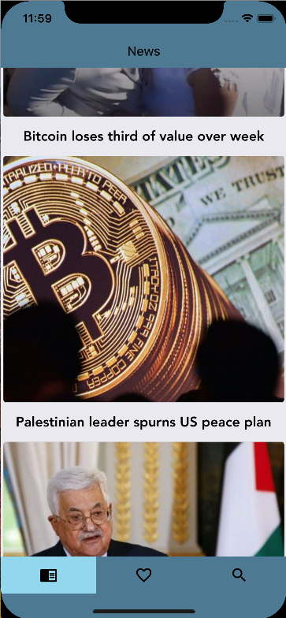

This project was bootstrapped with [Create React Native App](https://github.com/react-community/create-react-native-app).

# Aggreg8
In the wide world of real-time information, it’s important to keep up with the latest information that’s relevant to you around news, friends, and inspirational figures.  This app allows a user to view an aggregation of different feeds such as Twitter, Facebook, or Google news feeds, presented in a configurable, responsive UI.

### Instructions:
This app is in beta and not yet deployed for client use. If you'd like to try out the service, contact me for the developer keys: gabrieldefazio@gmail.com. 

  

